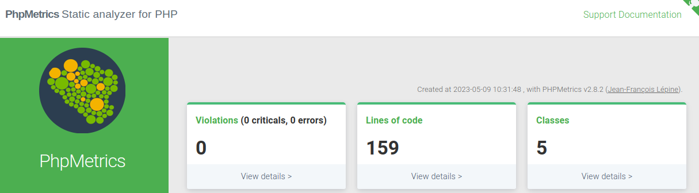
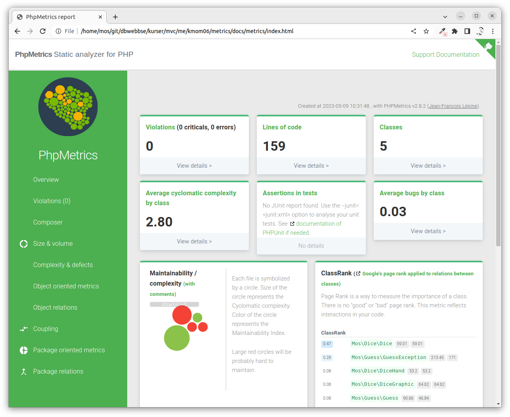

<!--
---
author: mos
revision:
    "2023-05-11": "(C, mos) Add phpunit integration."
    "2023-05-09": "(B, mos) Reviewed."
    "2022-03-27": "(A, mos) First release."
---

-->


Quality metrics of your PHP code
==========================

This exercise will show you how to get going with quality metrics using the tool phpmetrics.


<!--
TODO

* 

-->

The tool phpmetrics
--------------------------

The tool [phpmetrics](https://phpmetrics.github.io/website/) will read your source code and create an HTML report containing quality metrics on your code. This type of information can indicate the level of code quality or code complexity. Using this tool can help you work with your code to improve the various quality aspects.

The recommendation is to install the tool in the directory `tools/` so it does not conflict with your application.

We will use the tool wget to download a PHAR containing the tool in one PHP executable.

```
# Go to the root of your Symfony directory
mkdir --parents tools/phpmetrics
composer require --working-dir=tools/phpmetrics phpmetrics/phpmetrics
```

You can now execute the tool like this.

```
tools/phpmetrics/vendor/bin/phpmetrics --version
tools/phpmetrics/vendor/bin/phpmetrics --help
```


Quality metrics
--------------------------

The tool phpmetrics can produce several quality metrics from your code. You can list all metrics available like this.

```
tools/phpmetrics/vendor/bin/phpmetrics --metrics
```

Looking at the list we find for example metrics for:

* Cohesion (LCOM)
* Coupling (Afferent and Efferent)
* Cyclomatic complexity


Metrics report by text
--------------------------

You can now analyze the metrics on your code in the `src/` directory like this.

Execute the tool to generate a report.

```
tools/phpmetrics/vendor/bin/phpmetrics src
```

You will get a printed report with the metrics.

Try to analyze your code and find at least values for the following metrics.

* Cohesion (LCOM)
* Coupling (Afferent and Efferent)
* Cyclomatic complexity

Did your code contain any "Violations"? That is bad code and is usually detected by linters.


Metrics report by HTML
--------------------------

You can generate an HTML report which contains more details and makes it easier to analyze your code.

```
tools/phpmetrics/vendor/bin/phpmetrics --report-html=docs/metrics src
```

Open your web browser to the report in the directory `docs/metrics`.

It can look like this.



Now you can click around to view the visualized metrics.


Configuration file for phpmetrics
--------------------------

You can add a configuration file to make it easier to run phpmetrics with various settings. There is a sample configuration file in [`phpmetrics.json`](phpmetrics.json). You can copy that file to the root of your project.

```
# You are in the root of the course repo
cp example/phpmetrics/phpmetrics.json me/report

# Or you are in the me/report directory
cp ../../example/phpmetrics/phpmetrics.json .
```

You can then execute the command like this to use the configuration file.

```
tools/phpmetrics/vendor/bin/phpmetrics --config=phpmetrics.json
```


Add phpunit report to the metrics
--------------------------

The configuration file for phpmetrics contains a setting that loads a junit report, if it exists. That enables you to see metrics from your unit tests.

You need to add the following in the phpunit configuration file so it generates a junit report.

```xml
    <logging>
        <junit outputFile="docs/junit.xml" />
    </logging>
```

Then run your unit tests again and then generate the metrics report again.


Composer scripts
--------------------------

To make it easier to execute the tools you can add them to the script section of your `composer.json`.

This is how you can add the scripts.

```
{
    "scripts": {
        "phpmetrics": "tools/phpmetrics/vendor/bin/phpmetrics --config=phpmetrics.json"
    }
}
```

You can verify that your update did not make the `composer.json` corrupt by running the following command.

```
composer validate
```

If all seems okay you should be able to execute the tool like this.

```
composer phpmetrics
```

You can read more on "[composer and writing custom commands](https://getcomposer.org/doc/articles/scripts.md#writing-custom-commands)".
