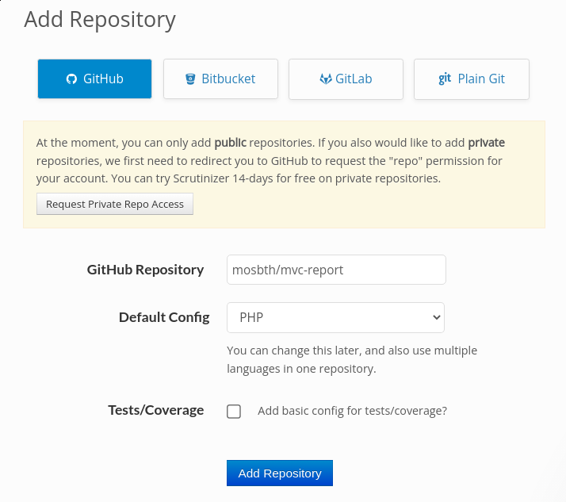
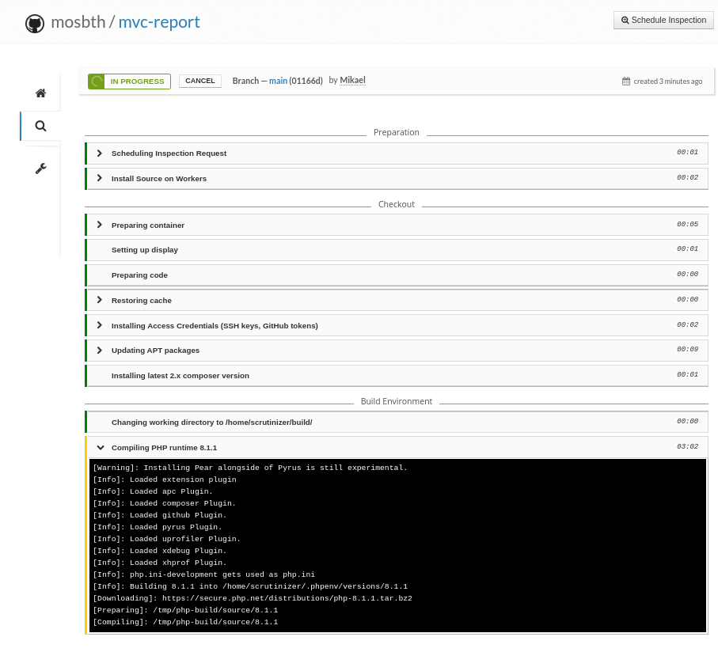
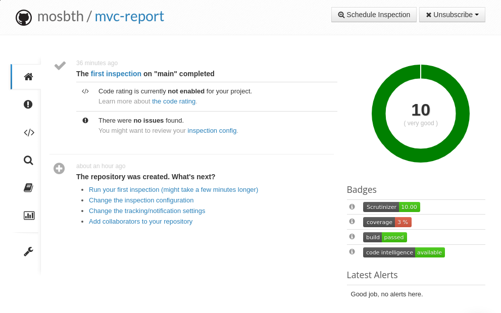

Integrate your repo with Scrutinizer
==========================

This exercise will show you how to integrate your git repository with the external build and code inspection service Scrutinizer.


The build service Scrutinizer
--------------------------

A CI service like [Scrutinizer](https://scrutinizer-ci.com/) will check out your code on your every update of your GitHub/GitLab repo and it will then execute your testsuite and analyse your code. As a result you can get a few badges showing the status of your code.

Here are badges from a set of example projects. Can you say something about the code quality by just looking at the badges?

[](https://scrutinizer-ci.com/g/canax/router/build-status/master) [](https://scrutinizer-ci.com/g/canax/router/?branch=master) [](https://scrutinizer-ci.com/g/canax/router/?branch=master)

[](https://scrutinizer-ci.com/g/canax/database/build-status/master) [](https://scrutinizer-ci.com/g/canax/database/?branch=master) [](https://scrutinizer-ci.com/g/canax/database/?branch=master)

[](https://scrutinizer-ci.com/g/mosbth/cimage/build-status/master) [](https://scrutinizer-ci.com/g/mosbth/cimage/?branch=master) [](https://scrutinizer-ci.com/g/mosbth/cimage/?branch=master)


Get a Scrutinizer account
--------------------------

You need to create an account at the Scrutizer service, you can use your GitHub account if you wish.

The Scrutinizer service provides free builds for open source projects so it will be free of charge to use it.


Prepare your repo
--------------------------

Fullfill the following requirements to prepare your repo to be connected to the Scrutinizer build service.

You have a public repo at GitHub/GitLab.

In your repo you can do the following tasks through composer (or by running the command directly).

```
# Check code style
composer phpcs

# Copy and paste detector
composer phpcbf

# Lint and mess detector
composer phpmd
composer phpstan

# Unit testing generates a build/coverage.clover
composer phpunit
```

You should ensure that phpcs, phpcbf, phpmd and phpstan passes before you connect your repo with Scrutinizer. That will help you get best results from Scrutinizer.

**Note.** You need to use `vendor/bin/phpunit` and not the `bin/phpunit` as the target when running the unit tests. The executable `bin/phpunit` is not installed by Scrutinizer.


Configuration file `.scrutinizer.yml`
--------------------------

Now you add a configuration file for Scrutinizer to your repo. This [`.scrutinizer.yml`](.scrutinizer.yml) will decide what Scrutinizer will do with your repo.

You can copy the sample configuration file like this.

```
# You are in the root of the course repo
cp example/scrutinizer/.scrutinizer.yml me/report

# You are in the me/report directory
cp ../../example/scrutinizer/.scrutinizer.yml .
```

The example configuration file will run your test suite using the command `composer phpunit`. The other local linters will not run, we will use Scrutinizers own linters to perform the code analysis.

You should open the configuration file and inspect it in your texteditor.

Scrutinizer will then run their own tools to analyse your code.

You can read more on the [Scrutinizer configuration file for PHP](https://scrutinizer-ci.com/docs/guides/php/continuous-integration-deployment).

The format of the configuration file is [YAML](https://en.wikipedia.org/wiki/YAML).


Connect the repo to Scrutinizer
--------------------------

Ensure that you have committed the configuration file `.scrutinizer.yml` to your repo and that you have pushed if to GitHub/GitLab.

Here is an example repo having the configuration file [`.scrutinizer.yml`](https://github.com/mosbth/mvc-report/blob/main/.scrutinizer.yml).

On the Scrutinizer web service you can add a connection to your repo. There is usually a + button on the top right of the page to "add a repository".

If my repo is `https://github.com/mosbth/mvc-report` then if can look like this when you add that repo.



If it all works out, then Scrutinizer will start its first build. You can follow the status of the build as is proceeds.




The first (or latest) build
--------------------------

If everything is green you will have the report from your first build available to inspect. Scrutinizer prepares a lot of details from analysing your code. Check out the results for your code and check if ou can see some quality metrics that you are custom to.

You can inspect the [latest build of my example project](https://scrutinizer-ci.com/g/mosbth/mvc-report/).

If your build fails, then check out the output from the build and try to find out what happened. You will usually get some verbose error message on what went wrong.

Try to fix the error and do a new commit. You can manually start (Schedule Inspection) a build on the Scrutinizer landing page for your project.

This is how it can look like when it passes the first build.




Get the badges
--------------------------

You should now get the badges for build status, code coverage and code quality and add them to the `README.md` of your project. Click the info button next to the badge to get the Markdown code to use in your README to display the badge.

You can see [my example project README.md](https://github.com/mosbth/mvc-report/blob/main/README.md) how it can look like.

These are the current badges from my example project.

[](https://scrutinizer-ci.com/g/mosbth/mvc-report/build-status/main) [](https://scrutinizer-ci.com/g/mosbth/mvc-report/?branch=main) [](https://scrutinizer-ci.com/g/mosbth/mvc-report/?branch=main)
