<!--
---
author: mos
revision:
    "2023-03-28": "(B, mos) Work through and very updated."
    "2022-03-27": "(A, mos) First release."
---

-->
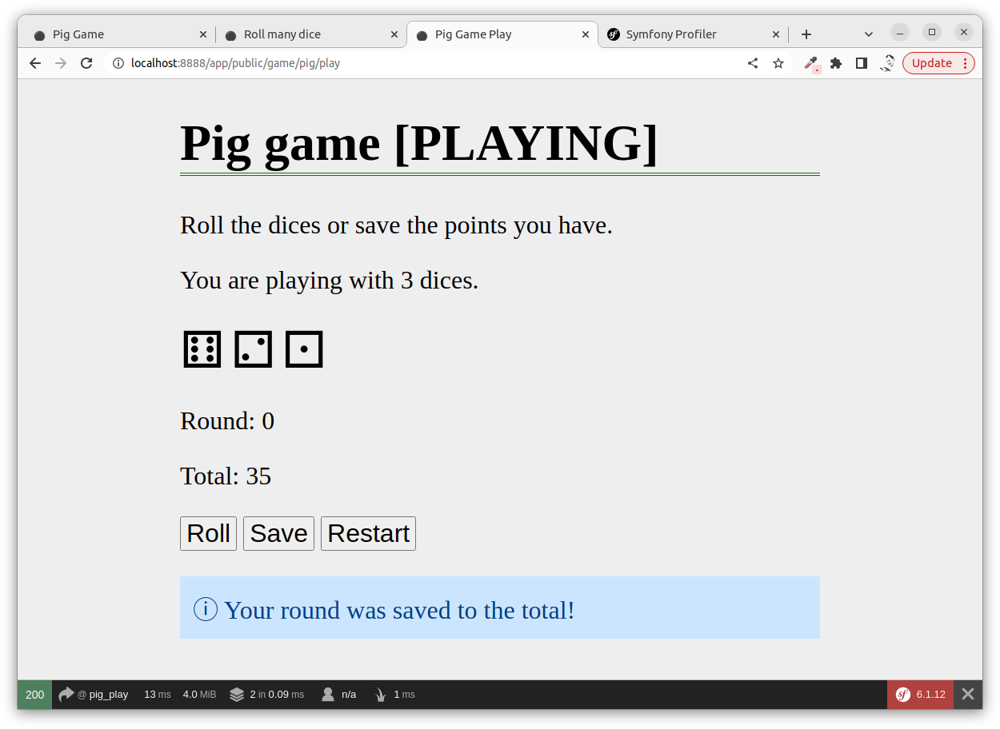

Write your application code in Symfony
==========================

This exercise will show you how to create and use your classes through a Symfony controller. The example code is built around [the dice game 100](https://en.wikipedia.org/wiki/Pig_(dice_game)).

The exercise starts by creating application classes `Dice`, `DiceGraphic` and `DiceHand` for the Pig game, it then ties the application classes together with the Symfony framework by using HTML forms, the session and utilities.


<!--
TODO

* MVC?
* komposition
* Win the game
* Disable buttons depending on state
* querystring
* dicehand composition
* add a counter to show the number of rounds

* debug session

-->


* [Prepare](#Prepare)
* [Example code](#Example-code)
* [An empty controller](#An-empty-controller)
* [Create a landing page](#Create-a-landing-page)
* [Dice class](#Dice-class)
* [Roll a dice](#Roll-a-dice)
* [Roll many dice](#Roll-many-dice)
* [Extend a base class](#Extend-a-base-class)
* [Composition and DiceHand](#Composition-and-DiceHand)
* [Set up the game](#Set-up-the-game)
* [Symfony session](#Symfony-session)
* [Make submit buttons go to own route](#Make-submit-buttons-go-to-own-route)
* [Store the dice](#Store-the-dice)
* [The first roll](#The-first-roll)
* [Save round](#Save-round)
* [Flash messages](#Flash-messages)
* [Summary](#Summary)


Prepare
--------------------------

You should have worked through the exercise "[Get going with Symfony](https://github.com/dbwebb-se/mvc/tree/main/example/symfony)".


Example code
--------------------------

All example code is saved in the directory `app/` so you can look at it or copy it to your site to see how it works as a complete application.

You can also work through this exercise step by step, to set up the basics of the application.

Here is a shortcut to creating a new Symfony app where you can write your code.

```text
composer create-project symfony/website-skeleton app
cd app
composer require webapp
```

```text
composer require symfony/webpack-encore-bundle
npm install
```

```text
composer require twig
```

Clear the cache if needed.

```text
bin/console cache:clear
```

<!--
* /build to build
* Change to main in the base template
-->

There is a video where Mikael shows how to set up your own copy of the code used in this exercise, step by step (in Swedish).

[](https://www.youtube.com/watch?v=h-FjY7IU69w)


An empty controller
--------------------------

To begin we create an empty controller, just so we have a starting point. I name the controller `DiceGameController` and I place it in `src/Controller/DiceGameController.php`.

```php
<?php

namespace App\Controller;

use Symfony\Bundle\FrameworkBundle\Controller\AbstractController;
use Symfony\Component\HttpFoundation\Response;
use Symfony\Component\Routing\Annotation\Route;

class DiceGameController extends AbstractController
{

}
```


Create a landing page
--------------------------

Let's create a landing page for the game. This is partly to verify that the controller works and to provide a starting point for the game.

The controller action part can look like this.

```php
    #[Route("/game/pig", name: "pig_start")]
    public function home(): Response
    {
        return $this->render('pig/home.html.twig');
    }
```

The template file is stored in `templates/pig/home.html.twig`.

Here is a sample for the landing page.

```php


Pig Game


<h1>Pig game</h1>

<p>This is a classical dice game called "Pig" where you roll a 
set of dices to try and reach 100 points. You can read more on 
the <a href="https://en.wikipedia.org/wiki/Pig_(dice_game)"> 
basics of the game on Wikipedia</a>.</p>


```

Here is a set of CSS code that provides some basic styling.

```css
body {
    margin: 0 auto;
    max-width: 800px;
    background-color: #eee;
    font-size: 2em;
}

input {
    font-size: 1em;
}

h1 {
    border-bottom: 4px double green;
}

.die {
    font-size: 2em;
}
```

It can look like this when we are done.

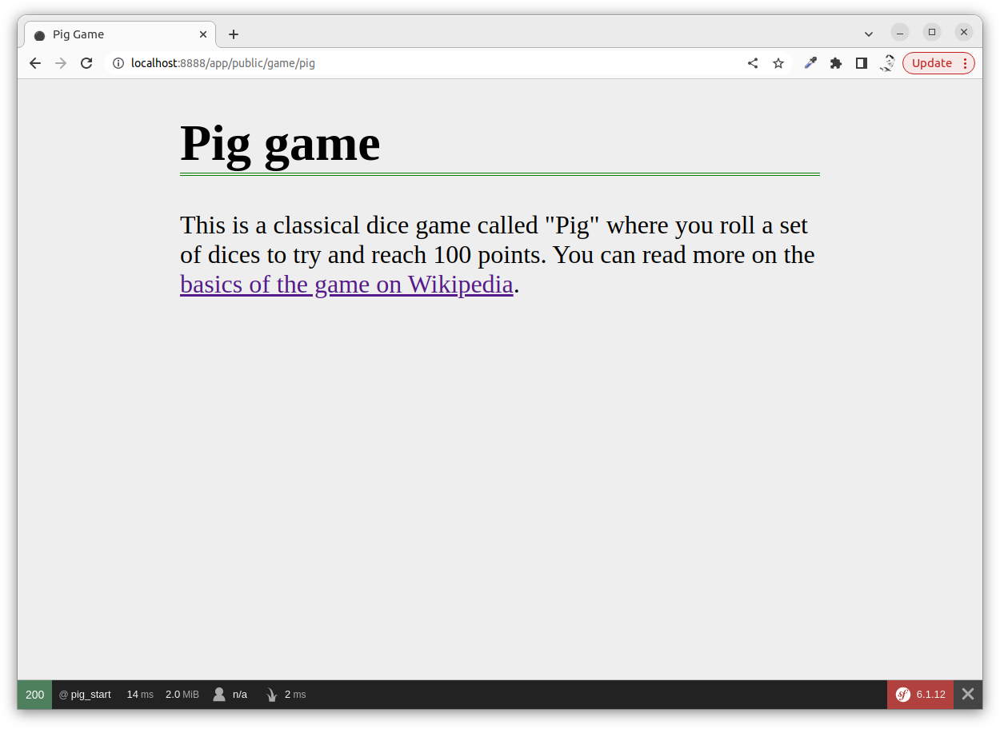

Now we are ready to create our application classes and test them.


Dice class
--------------------------

The first application class is the Dice class and it can look like this.

```php
namespace App\Dice;

class Dice
{
    protected $value;

    public function __construct()
    {
        $this->value = null;
    }

    public function roll(): int
    {
        $this->value = random_int(1, 6);
        return $this->value;
    }

    public function getValue(): int
    {
        return $this->value;
    }

    public function getAsString(): string
    {
        return "[{$this->value}]";
    }
}
```

The class has a namespace `App\Dice` so it must be stored in `src/Dice`. The class name is `Dice` so it must be saved in the file `Dice.php`.

This is now a "model class", it is the M in MVC. We can also call it an application class. It is one of many classes that build up an "application".

To use this class from Symfony we need to for example have a controller that uses this class.


Roll a dice
--------------------------

To roll the first dice and to show its value we add a controller method like this.

```php
    #[Route("/game/pig/test/roll", name: "test_roll_dice")]
    public function testRollDice(): Response
    {
        $die = new Dice();

        $data = [
            "dice" => $die->roll(),
            "diceString" => $die->getAsString(),
        ];

        return $this->render('pig/test/roll.html.twig', $data);
    }
```

You need to add the following use statement on the top of the file.

```php
use App\Dice\Dice;
```

The template file is stored in `templates/pig/test/roll.html.twig`. It can contain something like this.

```php

<h1>Roll a dice</h1>

<p>Here is the value of the dice.</p>

<ul>
    <li>{{ diceString }}</li>
</ul>

```

It can look like this when you are done.

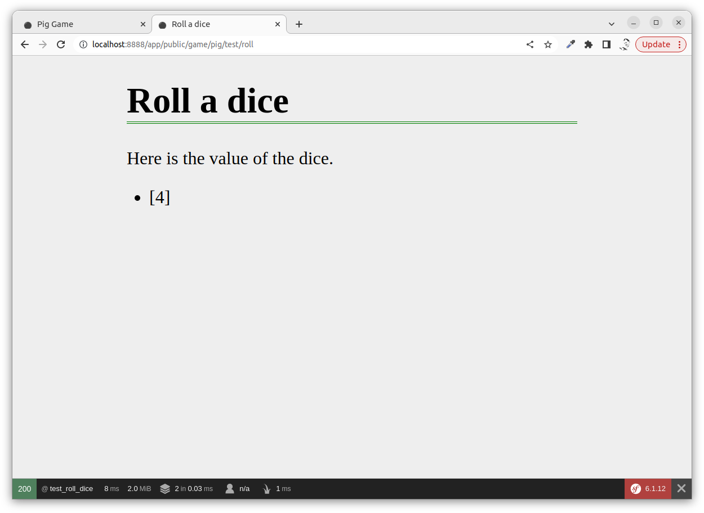

If you reload the page the dice value will change, as the dice is reloaded.


Roll many dice
--------------------------

Before you proceed you should update the code to roll as many dices as you want through the route `"/game/pig/test/roll/{num_dices}"`. Can you do that on your own?

The resulting view page can look like this when you are done.

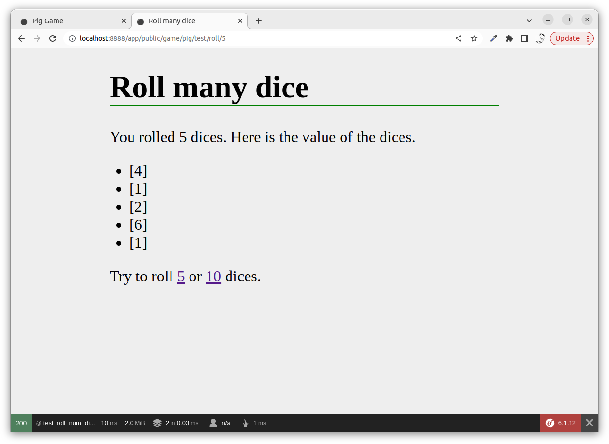

Try to write the code on your own, before you move on to see how it can be done.


### Solution

Start with a controller method.

```php
    #[Route("/game/pig/test/roll/{num<\d+>}", name: "test_roll_num_dices")]
    public function testRollDices(int $num): Response
    {
        if ($num > 99) {
            throw new \Exception("Can not roll more than 99 dices!");
        }

        $diceRoll = [];
        for ($i = 1; $i <= $num; $i++) {
            $die = new Dice();
            $die->roll();
            $diceRoll[] = $die->getAsString();
        }

        $data = [
            "num_dices" => count($diceRoll),
            "diceRoll" => $diceRoll,
        ];

        return $this->render('pig/test/roll_many.html.twig', $data);
    }
```

This controller method takes a route parameter that states how many dices that should be rolled.

We use a regular expression to [ensure that the route parameter is an integer](https://symfony.com/doc/current/routing.html#parameters-validation).

As a minor security prevention, we throw an exception if the number of dices is too high.

```php
        if ($num > 99) {
            throw new \Exception("Can not roll more than 99 dices!");
        }
```

Then we create and roll all the dice and save their results in an array.

```php
        $diceRoll = [];
        for ($i = 1; $i <= $num; $i++) {
            $die = new Dice();
            $die->roll();
            $diceRoll[] = $die->getAsString();
        }
```

The final step is to prepare to render the view.

```php
        $data = [
            "num_dices" => count($diceRoll),
            "diceRoll" => $diceRoll,
        ];

        return $this->render('pig/test/roll_many.html.twig', $data);
```

In the template file, a [twig for loop](https://twig.symfony.com/doc/2.x/tags/for.html) is used to print out the dice values from the array.

```php

<h1>Roll many dice</h1>

<p>You rolled {{ num_dices }} dices. Here is the value of the dices.</p>

<ul>

    <li>{{ roll }}</li>

</ul>

<p>Try to roll 
    <a href="{{ path('test_roll_num_dices', {num: 5}) }}">5</a>
    or 
    <a href="{{ path('test_roll_num_dices', {num: 10}) }}">10</a>
    dices.
</p>

```

Note how you can [use the path function to create a link to a named route that takes an argument](https://symfony.com/doc/current/templates.html#linking-to-pages).

```php
{{ path('test_roll_num_dices', {num: 5}) }}
```


Extend a base class
--------------------------

To show how to work with inheritance where a class extends another one, we create a `DiceGraphic` that has an improved variant on how to output the dice in a more "graphic" and pleasant way.

Here is the class `DiceGraphic` that extends the `Dice`. It is stored in the same directory as `DiceGraphic.php`.

```php
namespace App\Dice;

class DiceGraphic extends Dice
{
    private $representation = [
        '⚀',
        '⚁',
        '⚂',
        '⚃',
        '⚄',
        '⚅',
    ];

    public function __construct()
    {
        parent::__construct();
    }

    public function getAsString(): string
    {
        return $this->representation[$this->value - 1];
    }
}
```

To use this new class we can update the existing code and change what class is instantiated.

```php
            //$die = new Dice();
            $die = new DiceGraphic();
```

It can be like this in the code from the previous example.

```php
        $diceRoll = [];
        for ($i = 1; $i <= $num; $i++) {
            //$die = new Dice();
            $die = new DiceGraphic();
            $die->roll();
            $diceRoll[] = $die->getAsString();
        }
```

We must also add the statement to "use" the class.

```php
use App\Dice\DiceGraphic;
```

The result can be like this.

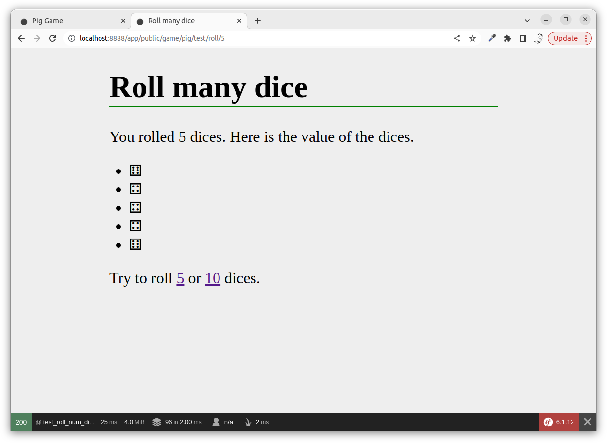

The application now uses the graphical die that extends the basic die. This is how you can use inheritance as a way to reuse and structure your application code.


Composition and DiceHand
--------------------------

An object that holds other objects is called composition, the object is said to be composed by other objects. A dice hand is composed of one die or more dice.

A `DiceHand` can look like this.

```php
namespace App\Dice;

use App\Dice\Dice;

class DiceHand
{
    private $hand = [];

    public function add(Dice $die): void
    {
        $this->hand[] = $die;
    }

    public function roll(): void
    {
        foreach ($this->hand as $die) {
            $die->roll();
        }
    }

    public function getNumberDices(): int
    {
        return count($this->hand);
    }

    public function getValues(): array
    {
        $values = [];
        foreach ($this->hand as $die) {
            $values[] = $die->getValue();
        }
        return $values;
    }

    public function getString(): array
    {
        $values = [];
        foreach ($this->hand as $die) {
            $values[] = $die->getAsString();
        }
        return $values;
    }
}
```

The class is stored in the file `src/Dice/DiceHand.php`.

Note that the actual dice objects are injected into the class. This enables the dice hand to ignore if it has a `Dice` or a `DiceGraphic` since both classes have the same base class.

We can try how that works by creating an example route like this.

```php
    #[Route("/game/pig/test/dicehand/{num<\d+>}", name: "test_dicehand")]
    public function testDiceHand(int $num): Response
    {
        if ($num > 99) {
            throw new \Exception("Can not roll more than 99 dices!");
        }

        $hand = new DiceHand();
        for ($i = 1; $i <= $num; $i++) {
            if ($i % 2 === 1) {
                $hand->add(new DiceGraphic());
            } else {
                $hand->add(new Dice());
            }
        }

        $hand->roll();

        $data = [
            "num_dices" => $hand->getNumberDices(),
            "diceRoll" => $hand->getString(),
        ];

        return $this->render('pig/test/dicehand.html.twig', $data);
    }
```

The code adds dice to the dice hand, for each DiceGraphic it also adds one Dice, just to show that the dice hand can work with any object that has the Dice as a base class.

You also need to add the use statement.

```php
use App\Dice\DiceHand;
```

THe template file `pig/test/dicehand.html.twig` can look like this.

```php

<h1>Roll dice hand</h1>

<p>You rolled {{ num_dices }} dices. Here is the value of the dices.</p>

<ul>

    <li>{{ roll }}</li>

</ul>

<p>Try to roll 
    <a href="{{ path('test_dicehand', {num: 5}) }}">5</a>
    or 
    <a href="{{ path('test_dicehand', {num: 10}) }}">10</a>
    dices.
</p>

```

It can look like this when you run the test route.

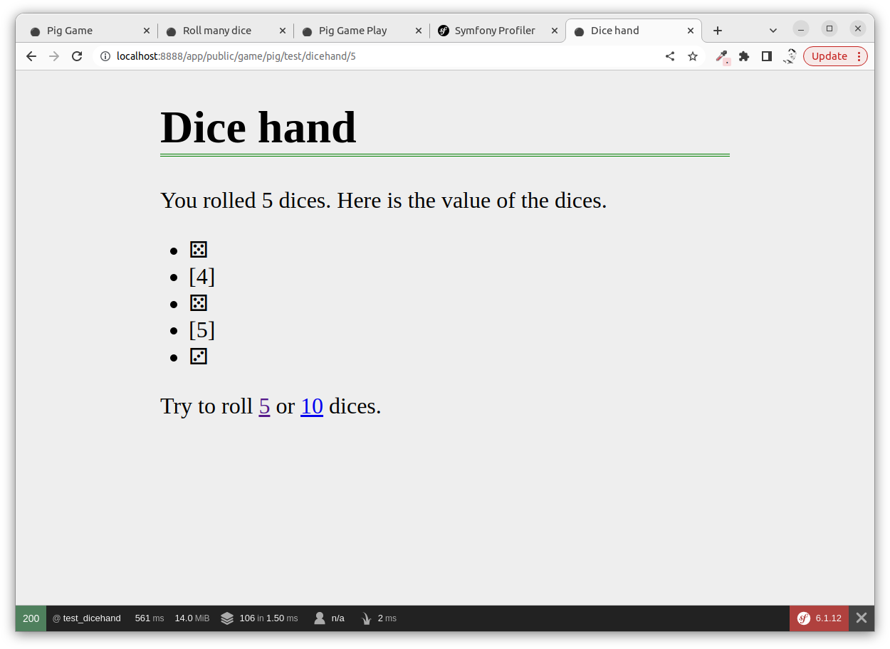

The DiceHand can hold Dice or DiceGraphic.


Set up the game
--------------------------

To make this look a bit more like the dice game "Pig" we can create a start page to initiate the game where the player can opt to play the game with any number of dice. To do this we create a form for the player to select.

Symfony has [a builtin feature for creating and working with Forms](https://symfony.com/doc/current/forms.html#creating-form-classes). However, for this example, we will use vanilla HTML forms created in the twig templates.


### The form

First comes the controller method. Notice that the route is only valid for GET requests.

```php
    #[Route("/game/pig/init", name: "pig_init_get", methods: ['GET'])]
    public function init(): Response
    {
        return $this->render('pig/init.html.twig');
    }
```

The twig creating the form can look like this.

```php

<h1>Pig game [START]</h1>

<p>How many dices do you want to have in your dice hand when playing the game?</p>

<form method="post" action="">
    <input type="number" name="num_dices" min="1" max="99" value="1">
    <input type="submit" name="do_it" value="Start playing">
</form>


```

Notify that it is a post form and it selfsubmits to the same url that it is displayed on.

It can look like this.

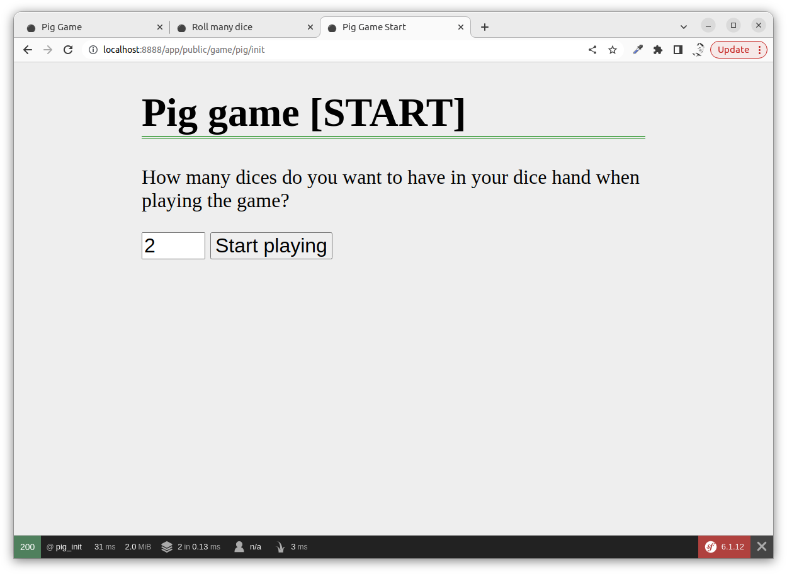


### The form callback

The submitted form needs a route handler that answers POST requests, like this.

```php
    #[Route("/game/pig/init", name: "pig_init_post", methods: ['POST'])]
    public function initCallback(): Response
    {
        // Deal with the submitted form

        return $this->redirectToRoute('pig_play');
    }
```

To make the example flow work, we also create the landing page at the named route `pig_play`.

```php
    #[Route("/game/pig/play", name: "pig_play", methods: ['GET'])]
    public function play(): Response
    {
        // Logic to play the game

        return $this->render('pig/play.html.twig');
    }
```

We add the template file `pig/play.html.twig` with the play buttons.

```php

<h1>Pig game [PLAYING]</h1>

<p>Roll the dices or save the points you have.</p>

<form method="post" action="">
    <p>
        <input type="submit" name="roll" value="Roll">
        <input type="submit" name="save" value="Save">
        <input type="submit" name="restart" value="Restart">
    </p>
</form>


```

This way we have in place the complete flow to start and play the game.

The game is not playable, but it can look something like this up till now.

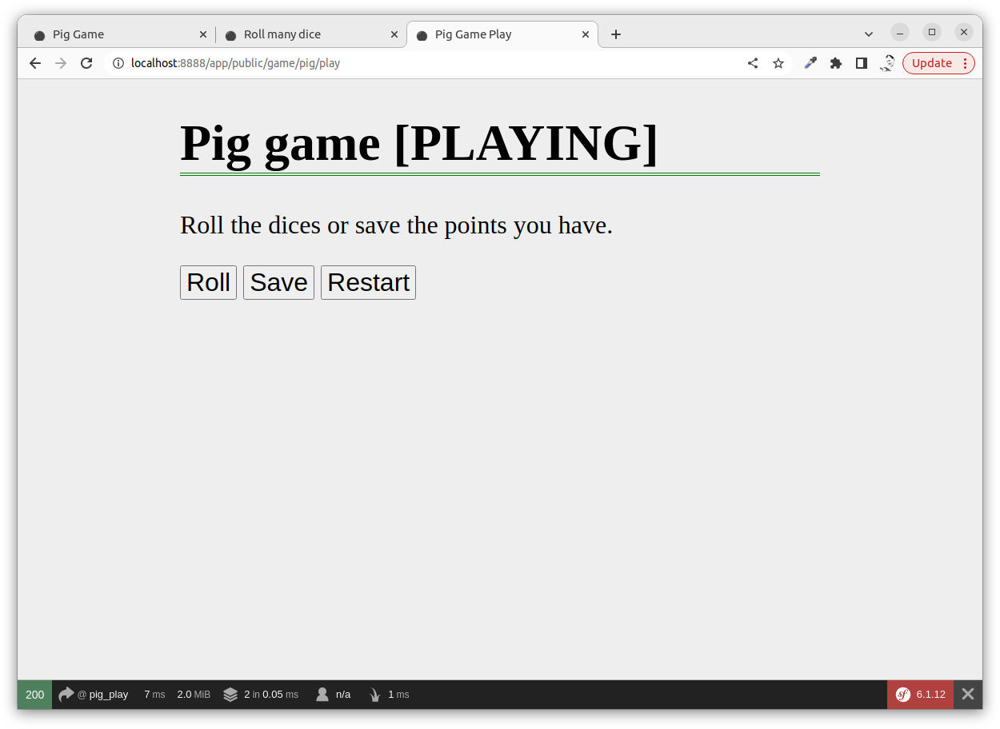

This game will need a session to work, so let's move on and create the game engine using the session to store the vital parts of the game state.


Make submit buttons go to own route
--------------------------

One thing that can help to organize the controller code is to make each button have its own callback, instead of having one callback for the form.

Looking at the image above you can see three buttons that need to be dealt with using the controller callbacks. If we add one line of JavaScript code for each button, we can change the url and method that the form is posted to. That enables each button to have its own controller method, even if the buttons reside in the same form.


### Restart button

The "Restart" button shall take the user to restart the game and select how many dice to play with again.

This is how the updated template code can look like.

```php
<input type="submit" name="restart" value="Restart"
    onClick="this.form.action='{{ path('pig_init_get') }}';this.form.method='get';"
>
```

The essential part is at the `onClick` attribute containing a small JavaScript that edits the form settings just before the submission is done.


### Roll button

The "Roll" button shall roll the dice and update the round sum.

We create an empty controller method for this.

```php
    #[Route("/game/pig/roll", name: "pig_roll", methods: ['POST'])]
    public function roll(): Response
    {
        // Logic to roll the dice

        return $this->render('pig/play.html.twig');
    }
```

This is how the updated template code can look like for the button.

```php
<input type="submit" name="roll" value="Roll"
    onClick="this.form.action='{{ path('pig_roll') }}';"
>
```


### Save button

The "Save" button shall take the user to restart the game and select how many dice to play with again.

We create an empty controller method for this.

```php
    #[Route("/game/pig/save", name: "pig_save", methods: ['POST'])]
    public function save(): Response
    {
        // Logic to save the round

        return $this->render('pig/play.html.twig');
    }
```

This is how the updated template code can look like for the button.

```php
<input type="submit" name="save" value="Save"
    onClick="this.form.action='{{ path('pig_save') }}';"
>
```

You should now be able to click on the buttons and the click should lead you to the right place.


Symfony session
--------------------------

We shall use the posted form to initiate the session. To do this we slightly modify the controller method we submit to.

```php
    #[Route("/game/pig/init", name: "pig_init_post", methods: ['POST'])]
    public function initCallback(
        Request $request,
        SessionInterface $session
    ): Response
    {
        $numDice = $request->request->get('num_dices');

        $session->set("pig_dices", $numDice);
        $session->set("pig_round", 0);
        $session->set("pig_total", 0);

        return $this->redirectToRoute('pig_play');
    }
```

This is a way to inject dependencies into a controller method.

```php
        Request $request,
        SessionInterface $session
```

You can then access the Symfony classes for the request and the session in the method. The request object contains the submitted form data and the session object contains the session.

You need to add the following use statements.

```php
use Symfony\Component\HttpFoundation\Request;
use Symfony\Component\HttpFoundation\Session\SessionInterface;
```

This way we now have a way to init the game where the session now contains the state of the game through the following variables.

```php
        $session->set("pig_dices", $numDice);
        $session->set("pig_round", 0);
        $session->set("pig_total", 0);
```

We can then update the play page to show the state of the game by reading the state from the session.

```php
    #[Route("/game/pig/play", name: "pig_play", methods: ['GET'])]
    public function play(
        SessionInterface $session
    ): Response
    {
        $data = [
            "pigDices" => $session->get("pig_dices"),
            "pigRound" => $session->get("pig_round"),
            "pigTotal" => $session->get("pig_total"),
        ];

        return $this->render('pig/play.html.twig', $data);
    }
```

Add the following to the template file to print out the details.

```php
<p>You are playing with {{ pigDices }} dices.</p>

<p>Round: {{ pigRound }}</p>
<p>Total: {{ pigTotal }}</p>
```

The page can look like this when the game starts.

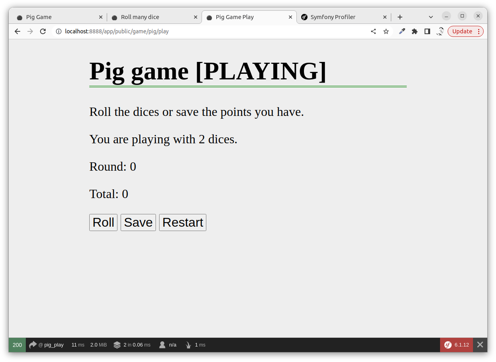

Now we can continue to make the first round and roll the dice.


<!-->
Make submit buttons go to own route
--------------------------

One thing that can help to organize the controller code is to make each button have its own callback, instead of having one callback for the form.

Looking at the image above you can see three buttons that need to be dealt with using the controller callbacks. If we add one line of JavaScript code for each button, we can change the url and method that the form is posted to. That enables each button to have its own controller method, even if the buttons reside in the same form.

This is how the template code can look like.

```php

<h1>Pig game [PLAYING]</h1>

<p>Roll the dices or save the points you have.</p>

<p>You are playing with {{ pigDices }} dices.</p>

<p>Round: {{ pigRound }}</p>
<p>Total: {{ pigTotal }}</p>

<form method="post" action="">
    <p>
        <input type="submit" name="roll" value="Roll"
            onClick="this.form.action='{{ rollUrl }}';"
        >
        
        <input type="submit" name="save" value="Save"
            onClick="this.form.action='{{ saveUrl }}';"
        >

        <input type="submit" name="restart" value="Restart"
            onClick="this.form.action='{{ restartUrl }}';this.form.method='get';"
        >
    </p>
</form>


```

The essential part is at the `onClick` attribute containing a small JavaScript that edits the form settings just before the submission is done.
-->


Store the dice
--------------------------

There might be several ways to implement the dice in this application. We will go with saving the dice hand in the session to show how the session can hold objects.

We update the `initCallback()` and create the dice hand with the correct number of dices and then save it to the session.

The code we add is this.

```php
        $diceHand = new DiceHand();
        for ($i = 1; $i <= $numDice; $i++) {
            $hand->add(new DiceGraphic());
        }
        $hand->roll();

        $session->set("pig_dicehand", $hand);
```

The updated method now looks like this.

```php
    #[Route("/game/pig/init", name: "pig_init_post", methods: ['POST'])]
    public function initCallback(
        Request $request,
        SessionInterface $session
    ): Response
    {
        $numDice = $request->request->get('num_dices');

        $hand = new DiceHand();
        for ($i = 1; $i <= $numDice; $i++) {
            $hand->add(new DiceGraphic());
        }
        $hand->roll();

        $session->set("pig_dicehand", $hand);
        $session->set("pig_dices", $numDice);
        $session->set("pig_round", 0);
        $session->set("pig_total", 0);

        return $this->redirectToRoute('pig_play');
    }
```

The complete state of the game, including the dice, is now saved in the session.

We then update so the route `pig_play` reflects this and outputs the value of the dice in the template file.

The controller method needs an update to get the dicehand from the session and translate their values into an array so they can be sent to the template.

```php
    #[Route("/game/pig/play", name: "pig_play", methods: ['GET'])]
    public function play(
        SessionInterface $session
    ): Response
    {
        $dicehand = $session->get("pig_dicehand");

        $data = [
            "pigDices" => $session->get("pig_dices"),
            "pigRound" => $session->get("pig_round"),
            "pigTotal" => $session->get("pig_total"),
            "diceValues" => $dicehand->getString() 
        ];

        return $this->render('pig/play.html.twig', $data);
    }
```

To output the dice values we need to add the following code into the template file.

```php
<p>

    <span class="die">{{ value }}</span>

</p>
```

It can now look like this when the game is ready to start, the dice are shown, but not yet calculated.

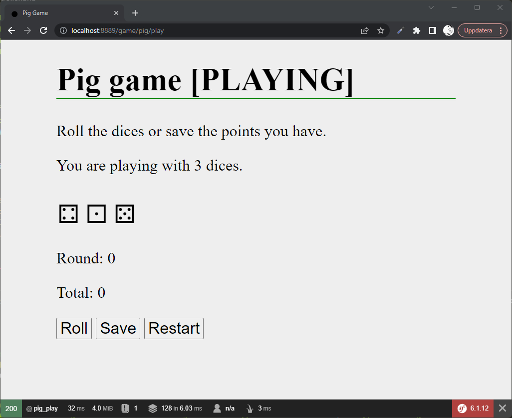

The code grows rather quickly now when we add application code, bit by bit.

At each step, we need to consider if the code is clean enough or if we can rewrite it in some way.


The first roll
--------------------------

To make a roll we click the "Roll" button and we reach the following controller method that we created earlier.

```php
    #[Route("/game/pig/roll", name: "pig_roll", methods: ['POST'])]
    public function roll(): Response
    {
        // Logic to make the roll

        return $this->redirectToRoute('pig_play');
    }
```

Here we want to use the dicehand from the session and roll the dices and add the sum to the current round, but only if the dicehand do not hold the value of 1.

```php
    #[Route("/game/pig/roll", name: "pig_roll", methods: ['POST'])]
    public function roll(
        SessionInterface $session
    ): Response
    {
        $hand = $session->get("pig_dicehand");
        $hand->roll();

        $roundTotal = $session->get("pig_round");
        $round = 0;
        $values = $hand->getValues();
        foreach ($values as $value) {
            if ($value === 1) {
                $round = 0;
                $roundTotal = 0;
                break;
            }
            $round += $value;
        }

        $session->set("pig_round", $roundTotal + $round);
        
        return $this->redirectToRoute('pig_play');
    }
```

The code rolls the dice and updates the round total as long as there is no die with 1.

It can look like this when you are on a good round.

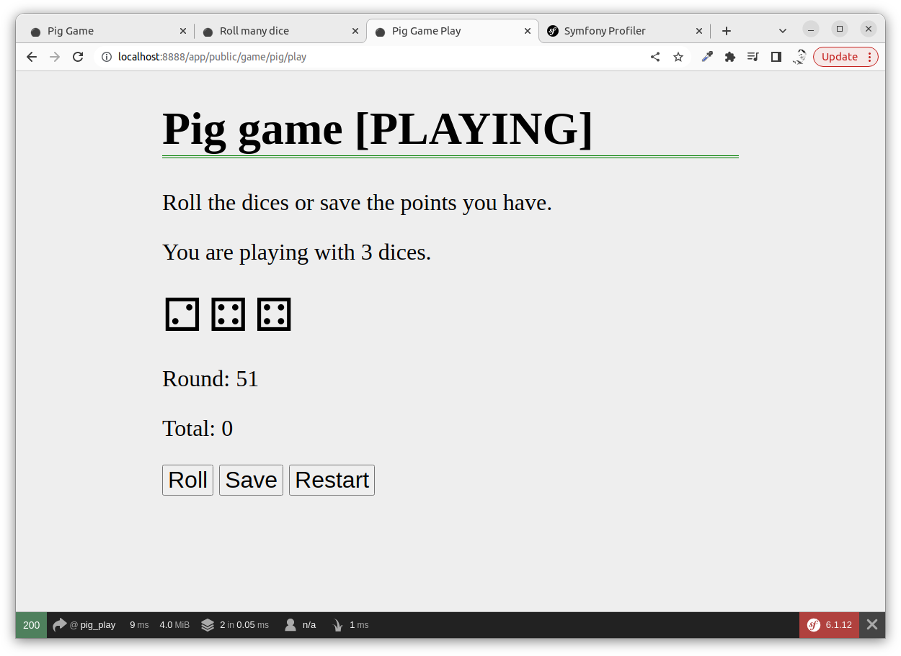

A good thing with this layout is that we can reload the current play page and the same game status is redrawn.


Save round
--------------------------

To save the round we click the "Save" button and reach the following controller method we created earlier.

```php
    #[Route("/game/pig/save", name: "pig_save", methods: ['POST'])]
    public function save(): Response
    {
        // Logic to save the roll

        return $this->redirectToRoute('pig_play');
    }
```

The idea is to move the sum from the round to the game total. It can look like this.

```php
    #[Route("/game/pig/save", name: "pig_save", methods: ['POST'])]
    public function save(
        SessionInterface $session
    ): Response
    {
        $roundTotal = $session->get("pig_round");
        $gameTotal = $session->get("pig_total");

        $session->set("pig_round", 0);
        $session->set("pig_total", $roundTotal + $gameTotal);

        return $this->redirectToRoute('pig_play');
    }
```

When playing the game it now can look like this.


Flash messages
--------------------------

Symfony can deal with [flash messages in the session](https://symfony.com/doc/current/session.html#flash-messages). This is helpful to send messages from a POST route to the next result page.

We could add such a message when the round is stored or when a die with 1 comes up.

The code to add a flash message looks like a notice looks like this.

```php
        $this->addFlash(
            'notice',
            'Your round was saved to the total!'
        );
```

You can add a warning like this.


```php
        $this->addFlash(
            'warning',
            'You got a 1 and you lost the round points!'
        );
```

There are several ways to write the code to output the flash message in the template, here is one of them.

```php
{# read and display all flash messages #}

    
        <div class="flash-{{ label }}">
            {{ message }}
        </div>
    

```

Try saving the code in its own template file `flash.html.twig` and include it into the template needing it by the following construct.

```php
{{ include('flash.html.twig') }}
```

As you can see from the HTML in the template above, you need to add style to make it appear as a notice and a warning message. Something like this.

```css
.flash-notice {
    padding: 0.5em;
    color: #004085;
    background-color: #cce5ff;
    border-color: #b8daff;
}
.flash-notice:before {
    content: "ⓘ";
}

.flash-warning {
    padding: 0.5em;
    color: #856404;
    background-color: #fff3cd;
    border-color: #ffeeba;
}
.flash-warning:before {
    content: "⚠";
}
```

It can look like this when it is integrated into the application.

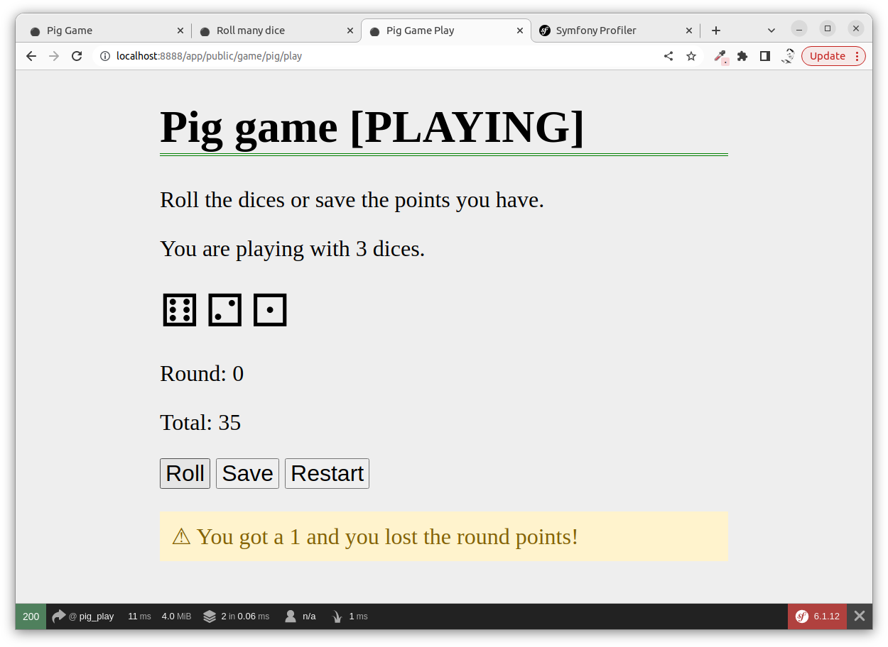


Summary
--------------------------

This was a walkthrough on how to work with the Symfony framework together with application classes and how to use HTML forms, request data, query string, route arguments and other small useful techniques when building a web application.
