<!--
---
author: mos
revision:
    "2025-03-31": "(D, mos) Updated to Symfony version 7.2."
    "2024-03-26": "(C, mos) Upgraded to Symfony version 7.0."
    "2023-03-28": "(B, mos) Work through and very updated."
    "2022-03-27": "(A, mos) First release."
---
-->

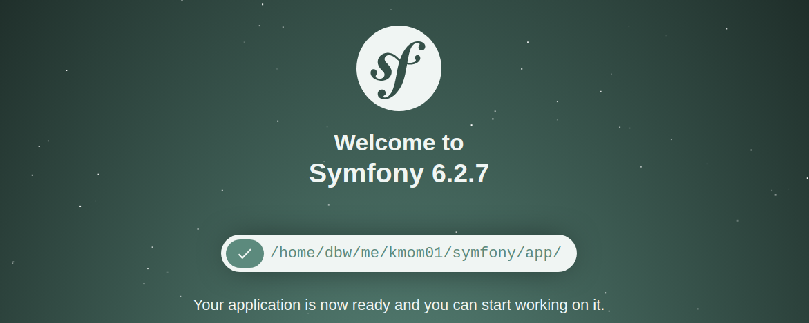

Get going with Symfony
====================

This exercise will help you create a web application/service using a Symfony installation.

You will add a controller that serves responses as web pages using the template engine Twig. You will also create a controller that provides a REST API with JSON responses.

<!--
TODO

* Run web server through the symfony tool

* Exercise create a form (min, max) that posts to a route generating a random number between min and max.

# 2024

* Add a logger and use it to debug

* Try using the Symfony demo application? https://github.com/symfony/demo

* Add image with encore and use through asset()?

# 2023

* How to send arguments to a route
    * `/api/lucky/number/1/100`
    * And through the querystring
    * How to verify its type
* Render form using Symfony, post 1 to 100

* Send object to twig and use methods/properties to print out details of the object.

-->


Documentation
----------------------------

The exercise is built on the [documentation of the Symfony project](https://symfony.com/doc/current). Use the documentation to learn more or as a reference if you get into trouble.


<!--
Video
----------------------------

There is a video where Mikael works through this exercise, step by step (in Swedish).

[](https://www.youtube.com/watch?v=1QVvLGNqTxw)
-->


Prerequisites
----------------------------

You have installed PHP in the terminal.

You have installed Composer, the PHP package manager.


Prepare
----------------------------

It is assumed that you are working in the course repository.

Start by copying the code for this exercise to your directory.

```bash

# Go to the root of the course repo
rsync -av example/symfony me/kmom01
cd me/kmom01/symfony
```


Install the project skeleton
----------------------------

We shall install and set up a skeleton for a Symfony web application using composer.

This part of the exercise comes from the article "[Installing & Setting up the Symfony Framework](https://symfony.com/doc/current/setup.html)". 

Ok, let's start to install a project skeleton using `composer create-project` into the directory `app`.

This creates a traditional Symfony web application.

```bash
composer create-project symfony/skeleton:"7.2.*" app
cd app
```

You can check what files are available in the app directory. You can see that there is merely only the file `composer.json`. You can open it to inspect it, it contains the details that will be installed to set up the Symfony application.

The directory `vendor/` is the place where all the downloaded files will be installed and the `composer.lock` contains the snapshot of all the installed packages and versions. You can inspect the content below the `vendor/` directory to see the structure of the installed packages.

You can now use composer to complete the installation of the web application.

```bash
composer require webapp
```

The process will start by checking that your system has all the necessary php extensions before installing.

If you get any questions during the installation procedure, just answer with the default reply by pressing enter.

You can check what packages are installed and what versions.

```bash
composer show
```

Before you proceed, check the content below `vendor/` again, it now contains a lot of directories with PHP packages.


Run your app
-----------------------

Let's start the application to verify that it works.

You can open the PHP built-in web server to verify the installation.

```bash
# You are in the app/ directory
php -S localhost:8888 -t public
```

The public web files are all under the `public/` directory so that is the starting point.

You should now be able to open a web browser to `http://localhost:8888` and see the welcome page.

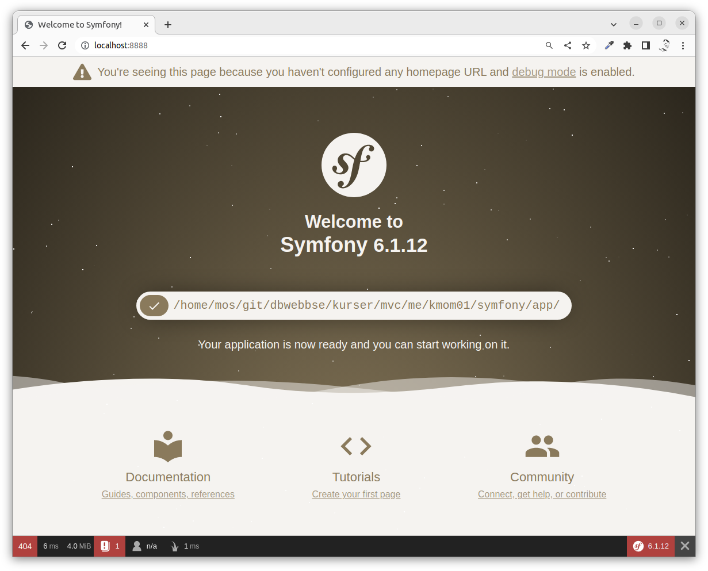


Publish the app to the student server
-----------------------

You can now try to run the application on the student server.

Start by copying the `.htaccess` file to the `public` directory.

```
# You are in the app directory
cp ../.htaccess public
```

The file `.htaccess` will now be in the root of your public web directory and it will set up the paths so the application will work on the student server. This [file can be used to configure the Apache web server](https://httpd.apache.org/docs/2.4/howto/htaccess.html). 

Edit the file `.htaccess` and change 'mosstud' to your acronym. Do also review that the path seems to be correct. Your images, stylesheets and the routing will not work if the acronym or path is incorrect.

Publish the application to the student server.

```
dbwebb publishpure me
```

Verify that you can see the welcome page correctly on the student server.


Create a home page using a controller
-----------------------

This shows how to create a home page in Symfony by using a controller. The information is based on the article [create your first page in Symfony](https://symfony.com/doc/current/page_creation.html).


### Add a controller and a route

Copy the controller file containing the code for the route `lucky/number`.

```
cp ../LuckyController.php src/Controller
```

This is the controller class that implements the controller action that is reachable through the route path (route) `lucky/number`.


### The controller class

The controller class looks like this. It is a PHP class using Symfony base classes.

Visit the class in `src/Controller/LuckyController.php` and review the code. Do you understand the structure and its parts?

```php
<?php

namespace App\Controller;

use Symfony\Component\HttpFoundation\Response;
use Symfony\Component\Routing\Annotation\Route;

class LuckyController
{
    #[Route('/lucky/number')]
    public function number(): Response
    {
        $number = random_int(0, 100);

        return new Response(
            '<html><body>Lucky number: '.$number.'</body></html>'
        );
    }
}
```

The controller action `number()` returns the complete html page as the response to the browser.


### Use `bin/console debug:router`

Now check that the route `lucky/number` is available and that Symfony recognizes it. Use the following command in the terminal when you are in the `app/` directory:

```
bin/console debug:router
```

You will see an entry like this, together with all other routes supported in the application.

```
 -------------------------- -------- -------- ------ ---------------
  Name                       Method   Scheme   Host   Path
 -------------------------- -------- -------- ------ --------------- 
  app_lucky_number           ANY      ANY      ANY    /lucky/number
 -------------------------- -------- -------- ------ ---------------
```

The application detects the route path from the attribute (annotation) `#[Route('/lucky/number')]` in the comment over the method.


### Visit the route

Open the route `lucky/number` in your browser to see that it works. It can look like this.

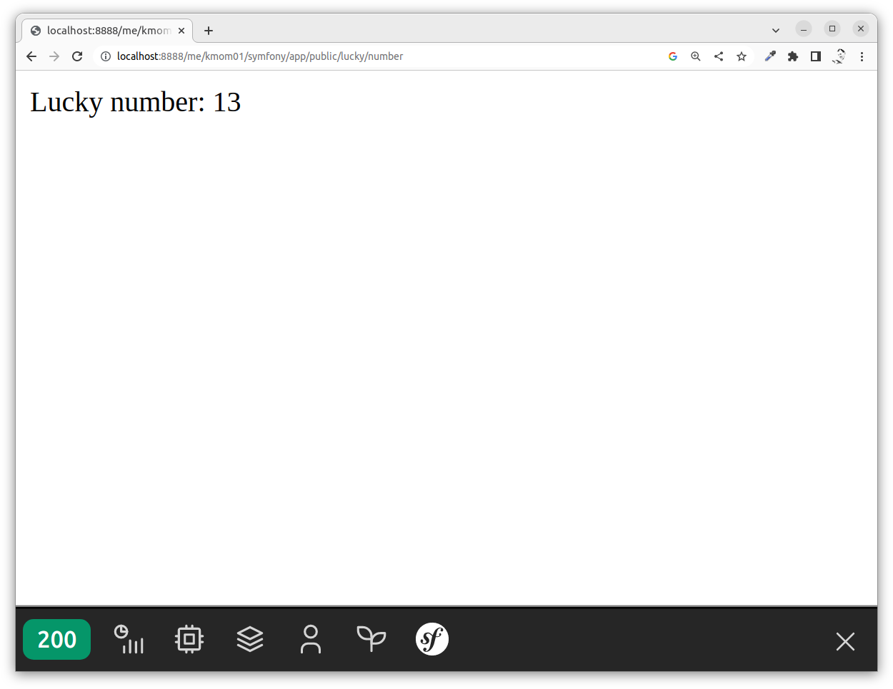

Inspect the code in the controller and make a few small changes to the web page so you get a feeling of "owning the code".


### Add another route

Now you can try to add another route, just to see that it works. Edit the controller class and add this method.

```php
    #[Route("/lucky/hi")]
    public function hi(): Response
    {
        return new Response(
            '<html><body>Hi to you!</body></html>'
        );
    }
```

Verify that the route is available by checking `bin/console debug:route` and then open it through the browser.

It can look like this.

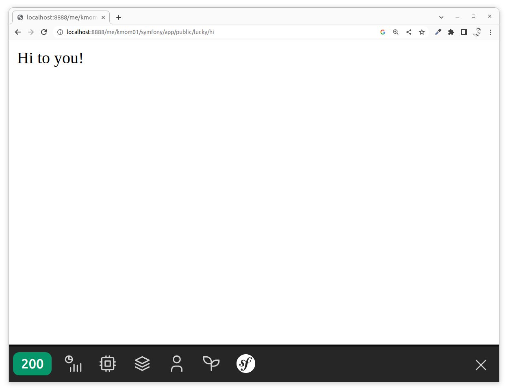


Symfony bin/console
----------------------------

The tool `bin/console` is a utility that can help develop and troubleshoot your application.

Here are a few examples on how to use it.

```
# Show the routes
bin/console debug:router

# Match a specific route
bin/console router:match /lucky/number

# Clear the cache
bin/console cache:clear

# Show available commands
bin/console
```

Verify that you can match both routes using the command `router:match`.

* `lucky/number`
* `lucky/hi`

Do also try a matching route that does not exist and view the error message it produces.


The controller
----------------------------

You can read about the structure of a [controller in Symfony](https://symfony.com/doc/current/controller.html) in the docs.

The controller is the C in the design pattern Model View Controller (MVC) and it is the entry point for the application.

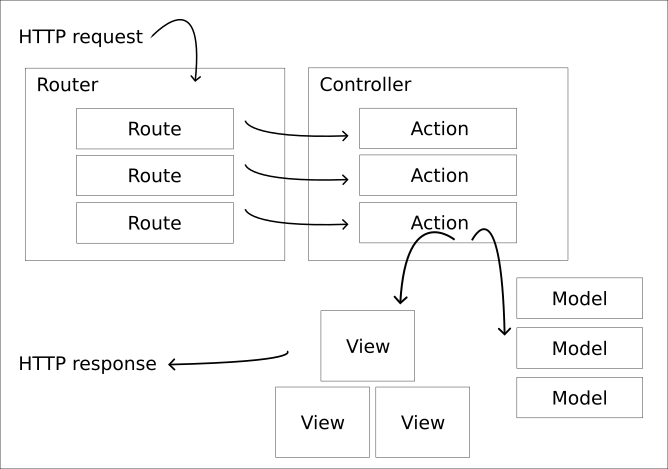

The url has a route path that is interpreted by the (Symfony) router and it leads to a controller action which has the responsibility to send a response back to the caller. It may take help of model classes and views when creating the response. In the example code above, the controller used no model classes and no views, it just returned the response directly as a web page.


Add a JSON route
----------------------------

When building a RESTFul API or a web service, the server usually provides a JSON response, instead of serving a web page as the reponse.

Here follows a `/api/lucky/number` version providing the number in a JSON structure instead of a web page. Add the method to your controller.

```php
    #[Route("/api/lucky/number")]
    public function jsonNumber(): Response
    {
        $number = random_int(0, 100);

        $data = [
            'lucky-number' => $number,
            'lucky-message' => 'Hi there!',
        ];

        $response = new Response();
        $response->setContent(json_encode($data));
        $response->headers->set('Content-Type', 'application/json');

        return $response;
    }
```

Verify that the route exists and can be used.

It can look something like this when displaying the results in a browser.

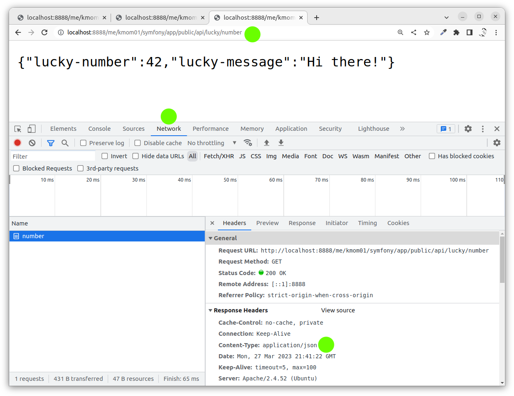

You can see that the HTTP response header is saying `application/json` indicating that the response is a JSON response.


### Use a JsonResponse

You can rewrite the above code and send a `JsonResponse` instead. That is a Symfony class specialized for JSON data and it slightly reduces your code.

```php
    #[Route("/api/lucky/number")]
    public function jsonNumber(): Response
    {
        $number = random_int(0, 100);

        $data = [
            'lucky-number' => $number,
            'lucky-message' => 'Hi there!',
        ];

        return new JsonResponse($data);
    }
```

You also need to add the following on the top, to be able to use the class `JsonResponse`.

```php
use Symfony\Component\HttpFoundation\JsonResponse;
```

Add it alphabetically so it looks like this at the top of the controller class.

```php
namespace App\Controller;

use Symfony\Component\HttpFoundation\JsonResponse;
use Symfony\Component\HttpFoundation\Response;
use Symfony\Component\Routing\Annotation\Route;

class LuckyController
```

Verify that the JSON response still works.


### JSON pretty print

When you return a large JSON structure it might sometimes be easier to read if you return it in a formatted way, also known as "pretty print". To do that you can use the following code to format the response before sending it.

```php
        // return new JsonResponse($data);

        $response = new JsonResponse($data);
        $response->setEncodingOptions(
            $response->getEncodingOptions() | JSON_PRETTY_PRINT
        );
        return $response;
```

A formatted pretty print show each property on its own row, so it will be easier to read it.

Update your method so it returns a pretty printed response and verify that it works.

It looks something like this.


Add a new controller
----------------------------

Let's try to add a new controller and move the method we just created doing `/api/lucky/number` into its own `src/Controller/LuckyControllerJson.php`.

Ok? You should then do the following.

1. Create a new controller file `src/Controller/LuckyControllerJson.php`.
1. Add an empty Controller class to it.
1. Move the method doing the `/api/lucky/number` into the class.
1. Verify that it works.

Here is an empty class if you want to start with that.

```php
<?php

namespace App\Controller;

use Symfony\Component\HttpFoundation\JsonResponse;
use Symfony\Component\HttpFoundation\Response;
use Symfony\Component\Routing\Annotation\Route;

class LuckyControllerJson
{

}
```

Always use the same capitalization on the file name and the class name.

The namespace `App\Controller` indicates that the filename should be saved in the directory `src/Controller`. It is a vital mapping that the PHP autoloader is using to find the source files.

Use the command `bin/console` to verify that the route only exists at one class and use your browser to verify that it works.

Now you know how to add new controller classes which is a vital part of structuring your code base.


Render a web page using a template
----------------------------

Let's use a template engine to do the rendering of the `$data` using a template file to create the resulting web page. We are to use the Twig template engine to do this.

Quickly browse the documentation on [the template engine Twig](https://twig.symfony.com/).


### Install Twig package

Start by installing the Twig package.

```
# You are in the app directory
composer require twig
```


### Create a controller using twig

Start by creating a new controller file `src/Controller/LuckyControllerTwig.php` and add the following empty class to it.

```php
<?php

namespace App\Controller;

use Symfony\Bundle\FrameworkBundle\Controller\AbstractController;
use Symfony\Component\HttpFoundation\Response;
use Symfony\Component\Routing\Annotation\Route;

class LuckyControllerTwig extends AbstractController
{

}
```

This controller extends the base class `AbstractController` which provides access to helper methods to render the content onto twig templates.

Now add the following method the to `LuckyControllerTwig` class.

```php
    #[Route("/lucky/number/twig", name: "lucky_number")]
    public function number(): Response
    {
        $number = random_int(0, 100);

        $data = [
            'number' => $number
        ];

        return $this->render('lucky_number.html.twig', $data);
    }
```

Use `bin/console` to verify that the route is detected by Symfony.

We still need to add the template file before we can use it.


### Create a template file

Create the file `templates/lucky_number.html.twig` and add the following code to it.

```twig
{# templates/lucky_number.html.twig #}

<h1>Your lucky number is {{ number }}</h1>
```

You can now open the route in your browser and see that it works.

It can look like this.

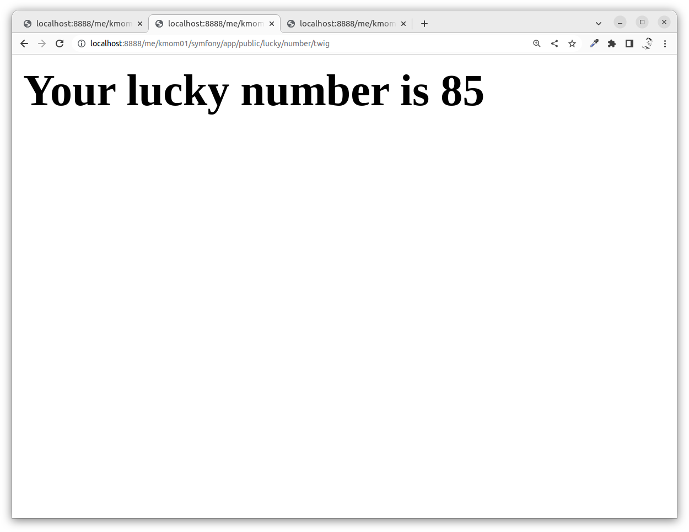


### Extend a base template

Twig allows you to include other templates by including them, but a more advanced feature is the feature to extend a base template. Twig calls this feature "template inheritance".

There is a file `templates/base.html.twig` and if you inspect it you see an html template file defining blocks that can be overridden by a template extending the base template.

Now take your `templates/lucky_number.html.twig` and rewrite it to look like this.

```twig


Magic number


    <h1>Magic number</h1>
    <p>Welcome to my awesome magical homepage.</p>
    <p>This is the current magic number: {{ number }}</p>

```

It can look like this in the browser.

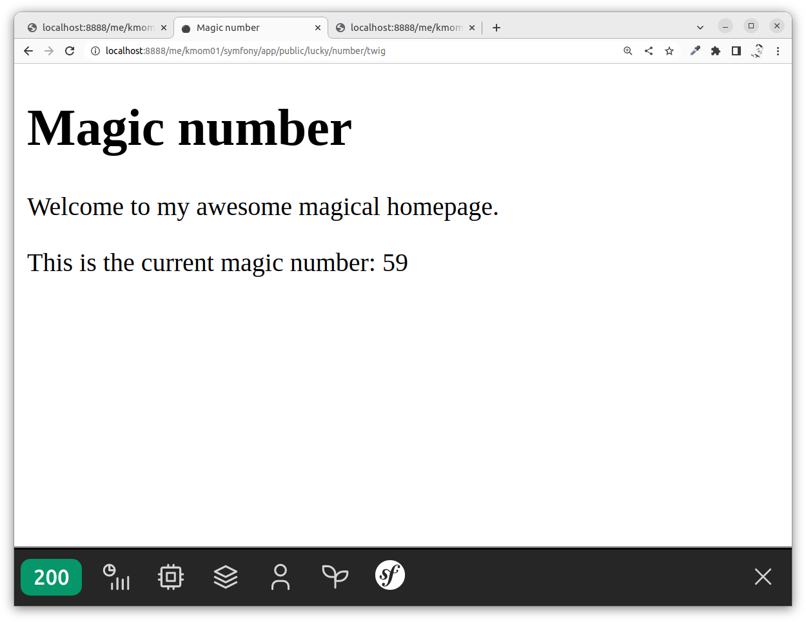


Include CSS and JavaScript in the base template
----------------------------

The base template `templates/base.html.twig` already contain blocks to set up CSS and JavaScript files.

These blocks use the Symfony tool Encore to manage static assets like stylesheets and JavaScripts.

Let's add a stylesheet and JavaScript using the Encore tool.


### Install Encore

First, we need to [install Encore](https://symfony.com/doc/current/frontend/encore/installation.html). This is how to do it.

```
composer require symfony/webpack-encore-bundle
npm install
```

You now have the directory `assets/` and the configuration file `webpack.config.js`. Review them both in your editor.


### Disable bootstrap.js

In the file `assets/app.js` you should comment out this line.

```js
import './bootstrap.js';
```

Otherwise, you need to install a package called "[StimulusBundle: Symfony integration with Stimulus](https://symfony.com/bundles/StimulusBundle/current/index.html)" which is an integration with a JavaScript Ux package and that is not our current focus.

It should look like this before you continue.

```js
// import './bootstrap.js';
```


### Setup the project using Encore

You can read in detail how to [set up the project using Encore](https://symfony.com/doc/current/frontend/encore/simple-example.html).

To ensure that the stylesheets and the JavaScript files are included, open up the configuration file `webpack.config.js` and edit this line.

```
    .setPublicPath('/build')
```

Remove the first slash to make it work even when the site is published as a subdirectory on the web server.

```
    .setPublicPath('build')
```

You can now build the assets like this.

```
npm run build
```

This will create a directory `public/build` where all your generated stylesheets and JavaScripts will go. The base template will then include them automatically.

Verify that it works by reloading your browser.


### Add style

You can add your style to the file `assets/styles/app.css`. Try to add the following and then rebuild the assets.

```css
body {
    margin: 0 auto;
    max-width: 400px;
}

h1 {
    border-bottom: 4px double #ccc;
}
```

Reload the page and it can now look like this.

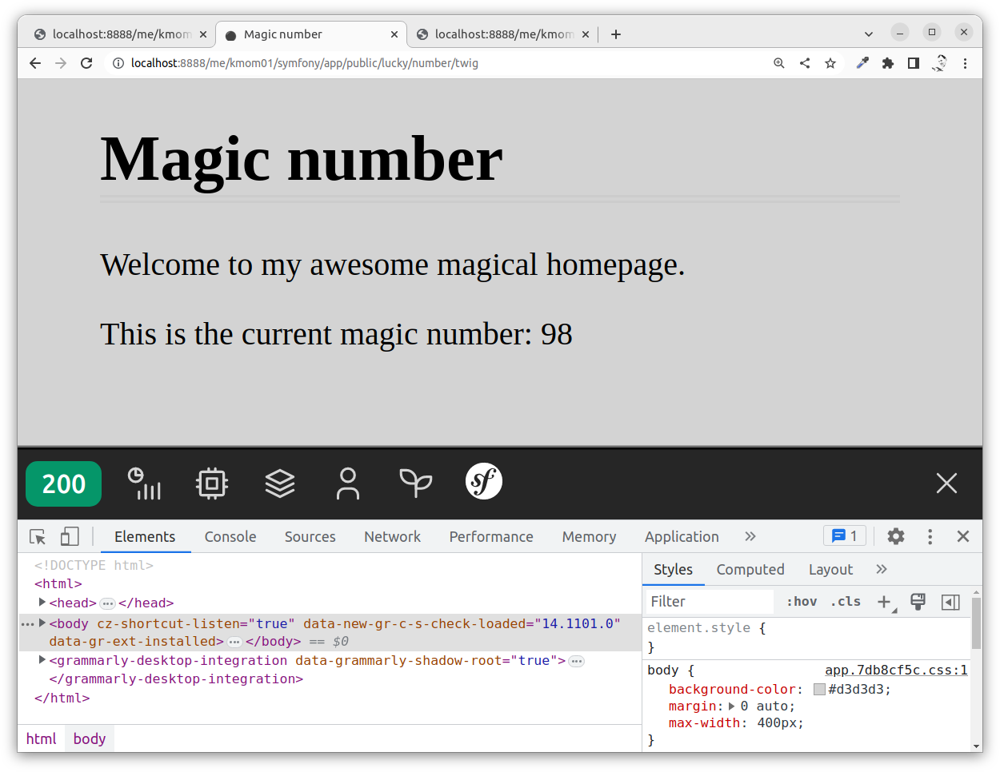


### Add JavaScript

You can add your own Javascript modules. Try creating a file `assets/js/hello.js` and add the following module code to it (you need to create the directory `assets/js`).

```javascript
export default () => {
    return `Yo yo - welcome to Encore!`
}
```

Then include and use the code from the `assets/app.js` like this.

```javascript
import hello from './js/hello.js';

console.log(hello())
```

Now you can rebuild and reload your browser to verify that it works.

It can look like this.

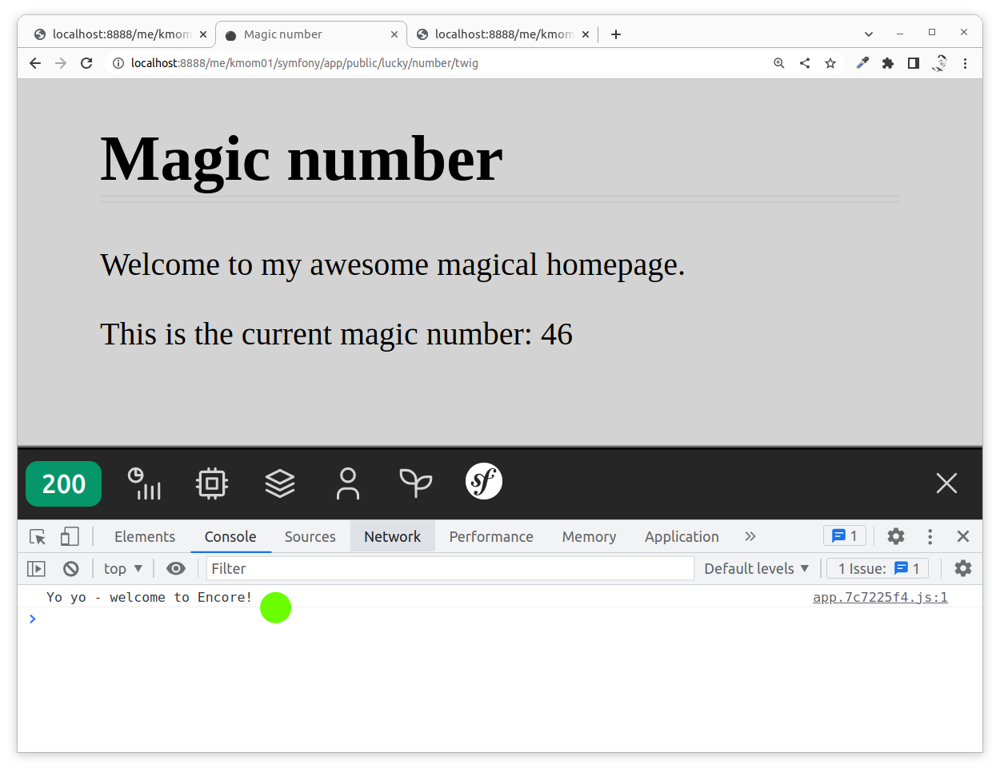


Navigate between pages
----------------------------

Let's add a navbar where we can navigate between the pages on the website.


### Add routes to home, about

Let's add two new routes in the class `LuckyControllerTwig` like this.

```php
    #[Route("/home", name: "home")]
    public function home(): Response
    {
        return $this->render('home.html.twig');
    }

    #[Route("/about", name: "about")]
    public function about(): Response
    {
        return $this->render('about.html.twig');
    }
```

You can see that you also need to add the template files that are used. For the time being, just add them like this.

* `templates/home.html.twig`

```twig


Home


    <h1>Home</h1>

```

* `templates/about.html.twig`

```twig


About


    <h1>About</h1>

```


### Add a navbar

We now want to add a navbar so we can navigate between the pages.

* Home -> `/home`
* About -> `/about`
* Lucky number -> `/lucky/number/twig`

The place to put this is into the base template, first in the body section. We can add it as HTML like this.

```html
<nav>
    <ul>
        <li><a href="{{ path('home') }}">Home</a></li>
        <li><a href="{{ path('about') }}">About</a></li>
        <li><a href="{{ path('lucky_number') }}">Lucky number</a></li>
    </ul>
</nav>
```

We are using the [Twig extension `path()` defined by Symfony](https://symfony.com/doc/current/reference/twig_reference.html#path) to create the url for the navbar.

Reload the page and verify that the navbar works. Perhaps you would like to add some style to the navbar?

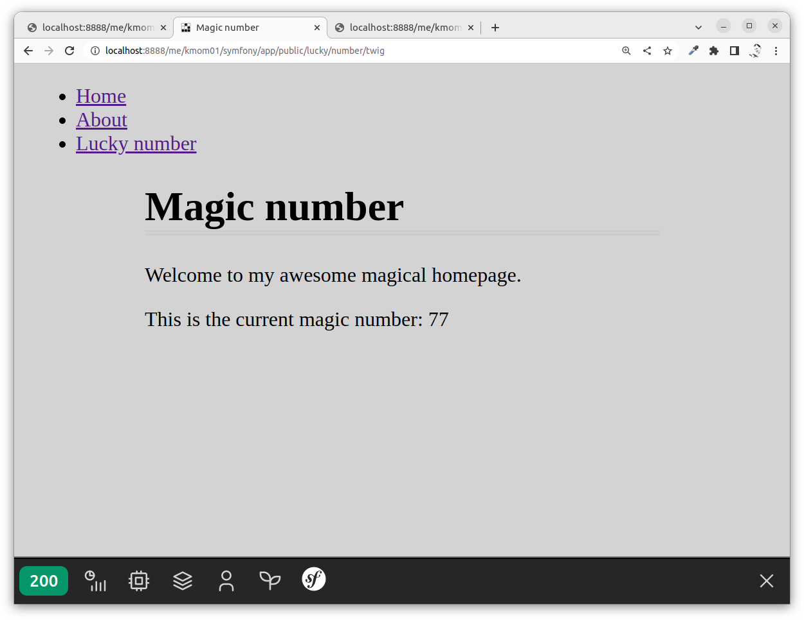


Use Symfony development server locally
----------------------------

We shall now change how we run the local web development server and we will use the one supplied by the Symfony CLI-tool. Start by installing the `symfony-cli`. You can read about the install options in [Symfony Local Web Server](https://symfony.com/download).

<details><summary>Bash Windows WSL/Linux</summary>

```bash
curl -1sLf 'https://dl.cloudsmith.io/public/symfony/stable/setup.deb.sh' | sudo -E bash
sudo apt install symfony-cli
```

</details>

<details><summary>macOS</summary>

```bash
brew install symfony-cli/tap/symfony-cli
```

</details>

Then we can start the Symfony local web server, like this. [Read more on the Symfony server in the docs](https://symfony.com/doc/current/setup/symfony_server.html).

```bash
symfony server:start
```

You can reach it through `http://127.0.0.1:8000`.

You can avoid some error messages if you opt to install the certificates to enable https. THis is how you do that.

<details><summary>Bash Windows WSL/Linux</summary>

```bash
sudo apt install libnss3-tools
symfony server:ca:install
```

</details>

<details><summary>macOS</summary>

```bash
brew install nss
symfony server:ca:install
```

</details>

Now try to restart the Symfony server and connect to the website using https instead at `https://127.0.0.1:8000/`.


Show images
----------------------------

Let's add a few images to the website to ensure that we can link to static assets like images.

We save the images in the directory `public/img` so let's create it.

```
mkdir public/img
```

We need to download a set of images. The following commands download two images.

```
curl -s https://upload.wikimedia.org/wikipedia/commons/4/45/Glider.svg > public/img/glider.svg
curl -s 'https://upload.wikimedia.org/wikipedia/commons/thumb/f/f1/Coastal_buildings_of_%C3%85rstein_by_Nordsiveien_road_in_Gratangen%2C_Troms_og_Finnmark%2C_Norway%2C_2022_June.jpg/1280px-Coastal_buildings_of_%C3%85rstein_by_Nordsiveien_road_in_Gratangen%2C_Troms_og_Finnmark%2C_Norway%2C_2022_June.jpg' > public/img/background.jpg
```

Check the content of the directory `public/img` and verify that there are two images there.

Now we will add those images to the webpage.


### Public image as an asset

Add the image to the page `/about` through the template file `templates/about.html.twig` like an ordinary image. Do also add a link so if the user clicks on the image, then the image is displayed in the browser.

```twig

    <h1>About</h1>
    <p>An image which can be clicked on.</p>
    <a href="{{ asset('img/glider.svg') }}">
        
    </a>

```

You can look up the twig function `asset()` in the same docs as the `path()` function.


### Add a favicon

Add a favicon, in the same manner, using `asset()`. This is done in the base template `templates/base.html.twig`.

```twig
    <link rel="icon" href="{{ asset('img/glider.svg') }}">
```

However, note that it already exists an entry for the favicon in the base template, so remove that before adding your entry.


### Add a header image

We can add a header that has a background image. This is done using CSS and we need to refer to the background image using CSS.

First, we add the header section in the base template `templates/base.html.twig`.

```twig
<header class="site-header" style="background-image: url({{ asset('img/background.jpg') }})">
    <span class="site-title">My Symfony Site</span>
</header>
```

The background image is added through the style attribute. That is one of many different ways to do it to deal with referencing an image from a stylesheet construct.

Then add some extra styling through the `asset/css/app.css` so you see the background image.

Altogether it might look like this. Well, I did some updates to my base template file and the other template files to make the header span the whole width of the page, so my result might look a bit different from yours, but it is related to some changes in the stylesheet.

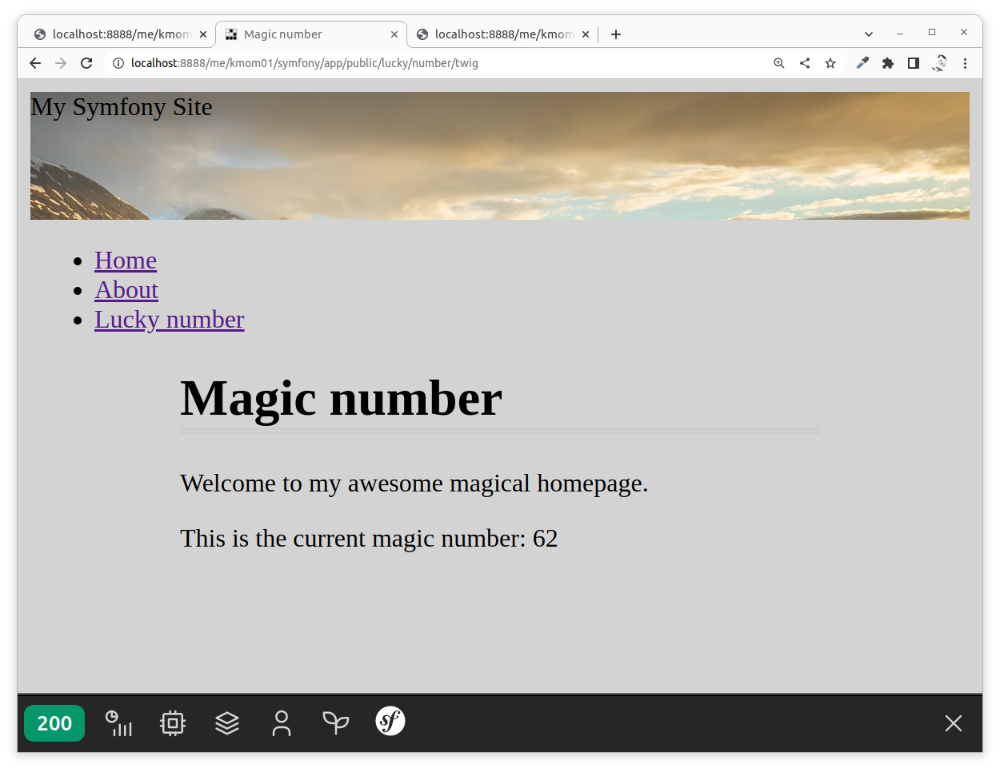

Feel free to update your templates to create the structure you want from the website.


### Add a background image through CSS and Encore

Another way to add images to the website is to add them through encore and the `asset/` directory.

Start by adding the following CSS code to your stylesheet.

```css
body {
    background: url('../images/background.jpg');
    background-size: cover;
}
```

The stylesheet is built as encore assets. Now try to build the assets.

You should get some error saying that the file can not be found. Add the image as an asset, like this.

```
# You are in the app directory
mkdir assets/images/
cp public/img/background.jpg assets/images/
```

Now rebuild your assets and then reload your web page. The stylesheet references the image and the build process includes both.

This is another way to add images as static assets, through the stylesheet. This way the images are maintained by the encore scripts and put into the `public/build` directory when built.

Review the content of the `public/build` to see if you can find the image there.


### Reference built asset images from templates

We shall see how to use the built images from the twig templates. This is good if we allow encore to handle more of our images.

The built images have strange names, something like this.

```
public/build/images/background.796ca3d8.jpg
```

But there is a manifest file `public/build/manifest.json` that translates the image names from their original name to their generated names. It contains entries like this.

```json
{
  "build/app.css": "build/app.77be5501.css",
  "build/app.js": "build/app.3f5ef326.js",
  "build/images/background.jpg": "build/images/background.796ca3d8.jpg"
}
```

To verify that it works we can add an image in one of our twig templates, for example in the about page. Make the twig template for the about page look like this.

```twig
    <h1>About</h1>
    <p>An image which can be clicked on.</p>
    <a href="{{ asset('img/glider.svg') }}">
        
    </a>
    
```

You can see from the last line how we address an asset in the build directory through its original name using `asset('build/images/background.jpg')`.

Reload the about page to verify that the image is loaded as expected.

If you want to use this tactic for more images (that are not already used in stylesheets of js-files) then you need to add the following to your `webpack.config.js`.

```
Encore
    .copyFiles({
        from: './assets/images',
        to: 'images/[path][name].[ext]'
    })
```

This will copy any image from the assets directory into the build directory. You can read more on how to let [encore copy files](https://symfony.com/doc/current/frontend/encore/copy-files.html).

You may get an error saying you should install the npm package `file-loader`, do so if it appears.


Where to go from here?
----------------------------

You now know the following about Symfony apps.

* How to install it.
* How to run it.
* How to add a controller and render web pages through views (template files) to your Symfony app.
* How to add routes that produce JSON responses which is an embryo of a RESTful API web service.

You might want to learn more about controllers and routing. Start reading here.

* [Controller](https://symfony.com/doc/current/controller.html)
* [Routing](https://symfony.com/doc/current/routing.html)

You might also find it useful to read up a bit more on Twig.

* [Twig for Template Designers](https://twig.symfony.com/doc/3.x/templates.html)

